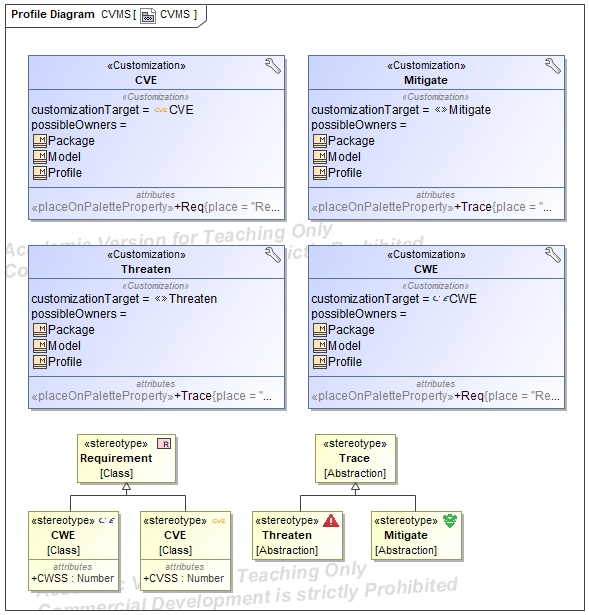
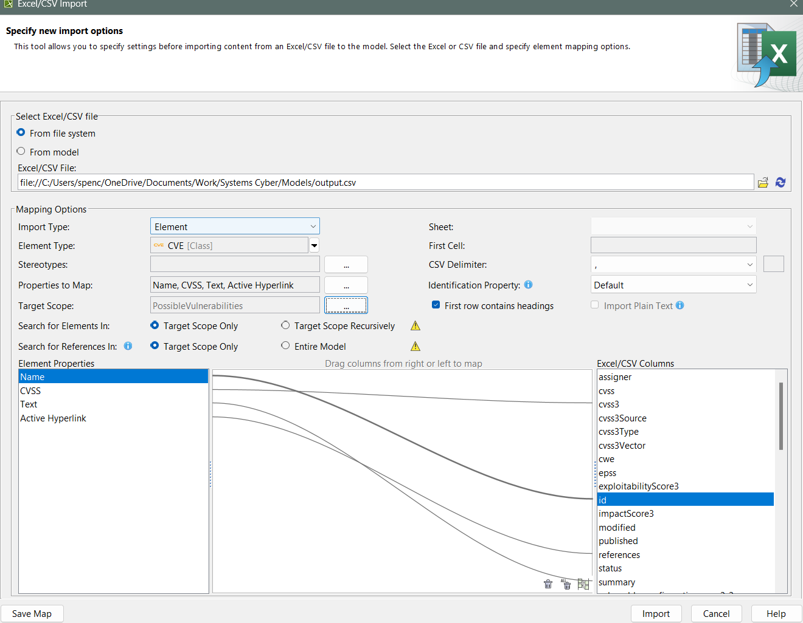

# CVMS Profile



This directory contains the SysML profile for Cybersecurity Vulnerability Management Systems (CVMS). This simple profile includes custom stereotypes and traceability relationships for documenting CVE and CWE data within SysML models. To use the profile:
1. Open Magic Systems of Systems Architect
2. Go to `Import From` > `Another Project...`
3. Select the [CVMS.mdzip](./CVMS.mdzip) file in this directory
4. Save the project, close it, and reopen it to ensure the profile is loaded correctly.
5. You can now apply the `<<CVE>>` and `<<CWE>>` stereotypes as within requirement diagrams / tables, and use the traceability relationships (`<<Threaten>>` and `<<Mitigate>>`) to document connections between vulnerabilities and system components or behaviors. 
   1. `<<Threaten>>` should be read as "this CWE/CVE threatens this system element"
   2. `<<Mitigate>>` should be read as "this system element mitigates this CWE/CVE"
   3. `<<Satisfy>>`, `<<Verify>>`, and `<<deriveReqt>>` can also be used as needed for additional traceability. For example, a structural element implementing a mitigation strategy could `<<Satisfy>>` a `<<CWE>>` requirement, whereas a reverse engineering artifact (behavioral) demonstrating the presence of a vulnerability could `<<Verify>>` a `<<CVE>>` requirement. Then, `<<deriveReqt>>` can be used to show that a `<<CVE>>` is derived from a `<<CWE>>`, or that a mitigation requirement is derived from a weakness/vulnerability requirement. There are many possible ways to use these relationships depending on the context.
6. You can also create CWEs and CVEs as model elements by creating them under the Containment Tree.

> Note: Requirements were chosen as the base metaclass because they provide built-in support for traceability (native support for `<<Satisfy>>`, `<<Verify>>`, `<<deriveReqt>>` relationships) and can be easily visualized in requirement diagrams and tables. 

## Reverse Engineering Workflow (Thesis Context)
To document weaknesses from reverse engineering a cyber-physical system, the following workflow can be used:
1. Download the CWE XML data from [MITRE CWE Downloads](https://cwe.mitre.org/data/downloads.html), assuming it hasn't enlarged to the size of the CVE database at this time.
2. Use `cwe-xml2msosa-csv.py` to convert the CWE XML data into CSV format.
3. [Import the generated CSV file](https://docs.nomagic.com/spaces/SYSMLP2024x/pages/136725295/Importing+data+from+Excel+and+CSV+files) into Magic Systems of Systems Architect using the CVMS SysML profile.

For example:


1. Map identified weaknesses (`<<CWE>>`) to system structure / behaviors and document relationships using SysML traceability features, then visualize (e.g., Dependency Matrix of threats and mitigations)
2. If a new vulnerability is discovered, document it in the SysML model under the `<<CVE>>` stereotype, and consider contributing it to public CVE databases if appropriate.
3. As system components are identified, Use the [cve-search](https://github.com/cve-search/cve-search) tool to retrieve CVE data relevant to the system's components (CPE). It's important to recognize that the CVE database is significantly larger than the CWE database, so targeted searches are recommended. The cve search tool can be set up locally to facilitate efficient querying, and privacy.
4. For example, to search for CVEs related to the ESP8266 module, run:
   ```bash
   ./search.py -f esp8266 > input.json
    ```
5. Use `json2csv.py` to convert CVE JSON data into CSV format as needed.
6.  Import the generated CSV file into Magic Systems of Systems Architect using the CVMS SysML profile.

For example:


1.  Analyze and document the vulnerabilities in the SysML model, mapping them to system components and behaviors as appropriate. Visualize relationships using SysML features (e.g., Dependency Matrix of threats and mitigations).

> Note: This workflow can be adapted to other SysML contexts as well. For example, in a forward engineering context, the CVMS profile can be used to proactively identify and mitigate potential vulnerabilities during system design. This thesis focuses on reverse engineering, where the system is already built, and weaknesses and vulnerabilities need to be identified and documented.

# Applied Case Studies

coming soon...