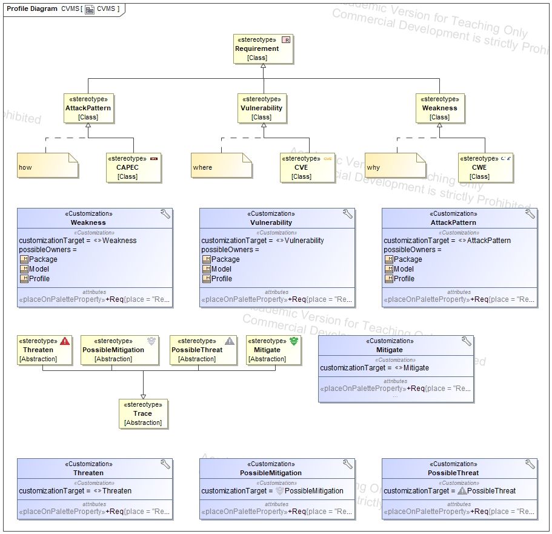
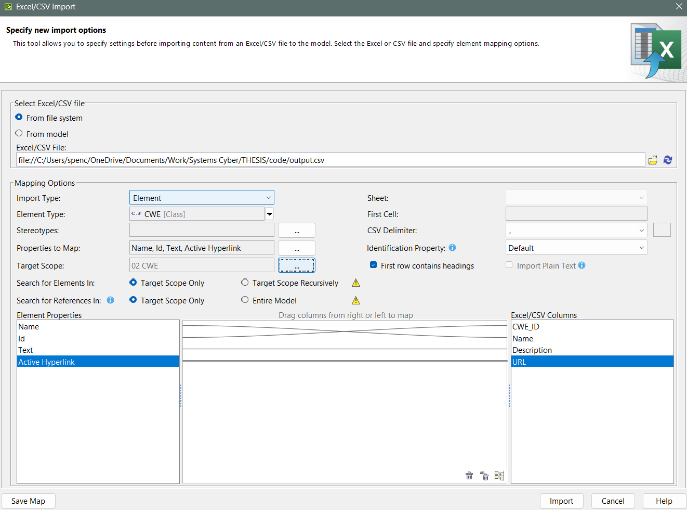
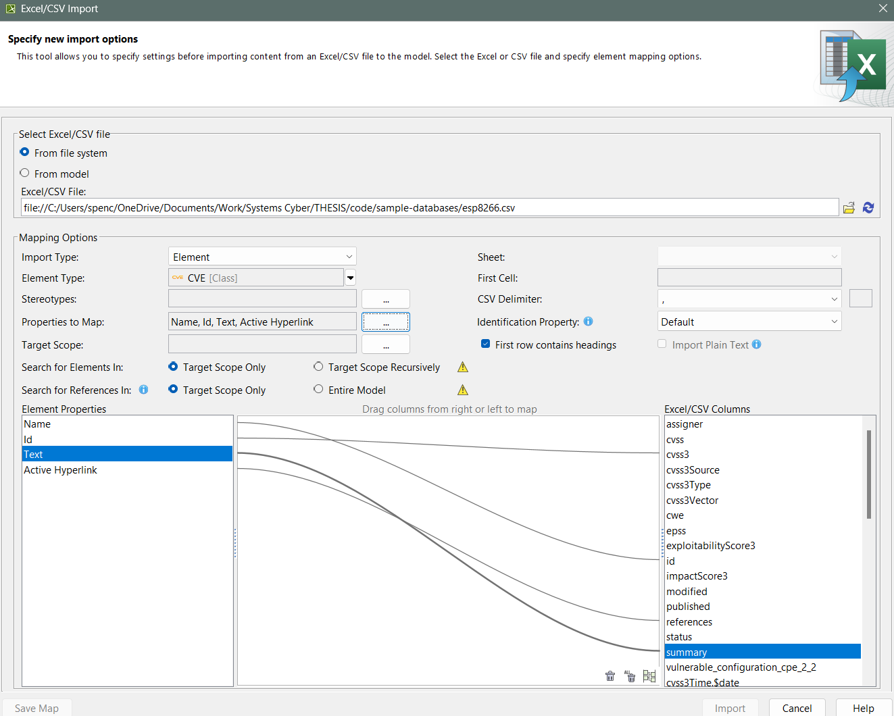
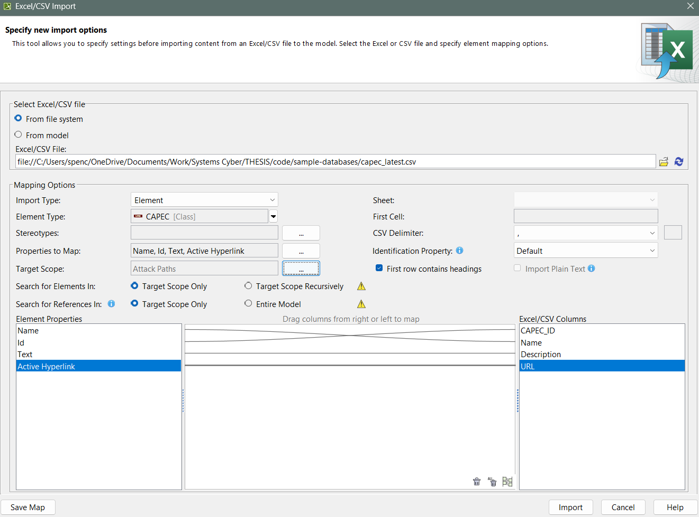

# CVMS Profile

This directory contains the SysML profile for Cybersecurity Vulnerability Management Systems (CVMS). This simple profile includes custom stereotypes and traceability relationships for documenting weakness, vulnerability, and attack pattern data within SysML models. To use the profile:
1. Open Magic Systems of Systems Architect
2. Go to `Import From` > `Another Project...`
3. Select the [CVMS.mdzip](./CVMS.mdzip) file in this directory
4. Save the project, close it, and reopen it to ensure the profile is loaded correctly.
5. You can now apply the stereotypes as needed within requirement diagrams / tables, and use the traceability relationships to document connections between vulnerabilities and system components or behaviors:
   1. `<<Threaten>>` should be read as "this [weakness, vulnerability, or attack pattern] threatens this system element"
   2. `<<Mitigate>>` should be read as "this system element mitigates this [weakness, vulnerability, or attack pattern]"
   3. `<<PossibleThreat>>` should be read as "this [weakness, vulnerability, or attack pattern] could possibly threaten this system element"
   4. `<<PossibleMitigation>>` should be read as "this system element could possibly mitigate this [weakness, vulnerability, or attack pattern]"
   5. `<<Weakness>>`, `<<Vulnerability>>`, and `<<AttackPattern>>` should be applied as library elements representing known weaknesses, vulnerabilities, and attack patterns, respectively. They can, and should, be traced to system elements using the above relationships:
      1. A `<<Weakness>>` or `<<CWE>>` should be mapped to SysML requirements (the root cause).
      2. A `<<Vulnerability>>` or `<<CVE>>` should be mapped to SysML structural components (the manifestation of the weakness in a specific system).
      3. An `<<AttackPattern>>` or `<<CAPEC>>` should be mapped to SysML behaviors (the method by which the vulnerability can be exploited).
6. You can also create create these model elements by creating them under the Containment Tree:
   1. `<<Weakness>>` or `<<CWE>>`, `<<Vulnerability>>` or `<<CVE>>`, and `<<AttackPattern>>` or `<<CAPEC>>` 

> Note: Requirements were chosen as the base metaclass because they provide built-in support for traceability (native support for `<<Satisfy>>`, `<<Verify>>`, `<<deriveReqt>>` relationships) and can be easily visualized in requirement diagrams and tables. The main objective of public enumerations like CWE, CVE, and CAPEC is to document and manage cybersecurity risks, which aligns well with the purpose of requirements in SysML.

## Reverse Engineering Workflow (Thesis Context)
To document weaknesses from reverse engineering a cyber-physical system, the following workflow can be used:

1. Download the CAPEC XML data from [MITRE CAPEC ](https://capec.mitre.org/).
2. Download the CWE XML data from [MITRE CWE](https://cwe.mitre.org/).
3. Download the CVE JSON data from [NIST NVD Data Feeds](https://nvd.nist.gov/vuln/data-feeds#JSON_FEED) or use the [cve-search](https://github.com/cve-search/cve-search) to stay updated with the latest vulnerabilities.
4. Use `capec-xml2msosa-csv.py` to convert the CAPEC XML data into CSV format.
5. Use `cwe-xml2msosa-csv.py` to convert the CWE XML data into CSV format.
6. Use `json2csv.py` to convert CVE JSON data into CSV format as needed.
7. Import the generated CSV files into Magic Systems of Systems Architect using the CVMS SysML profile.

For example:

1. Map identified weaknesses to requirements, vulnerabilities to system components, and attack patterns to behaviors, documenting relationships using CVMS SysML traceability features:
   1. `<<Threaten>>`
   2. `<<Mitigate>>`
   3. `<<PossibleThreat>>`
   4. `<<PossibleMitigation>>`
2. Visualize relationships using SysML features (e.g., Dependency Matrix of threats and mitigations). If using a dependency matrix, consider creating separate matrices for:
   1. Weaknesses vs. Requirements
   2. Vulnerabilities vs. System Components
   3. Attack Patterns vs. Behaviors

For example:

.jpg)
.jpg)
.jpg)

> Note: You still want to satisfy, verify, and derive *new requirements* as appropriate using the native SysML relationships. This workflow can be adapted to other SysML contexts as well. For example, in a forward engineering context, the CVMS profile can be used to proactively identify and mitigate potential vulnerabilities (`<<PossibleThreat>>`) and mitigations (`<<PossibleMitigation>>`) during system design. This thesis focuses on reverse engineering, where the system is already built, and weaknesses, vulnerabilities, and attack paths need to be identified and documented because the system is closed-source.

# Applied Case Studies

1. [Marine Gateway Devices](./Marine%20Gateways/)